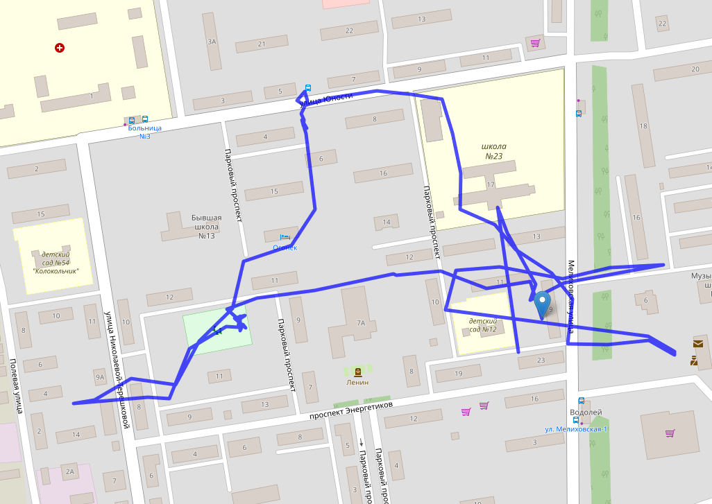

## watch8001  
  
Маленький сервер, который позволяет получить данные из детских часов, таких как:
* Aimoto start   
* K911  
* и т.д.  

  

### Требования:
1. Mysql   
2. Python 3.X

### Реализовано:  
1. Авторизация  
2. Получение координат  
3. Вебсервер для получения текущих данных  

### Настройки:  
`urlServiceReportPositions = "/gps/"` - путь урл  
`nameClientDB = 'clients'` - Имя базы, где хранятся данные о местоположении  
`portServer = 8001` - Порт по которому получаем данные от часов  
`portHTTP = 8080` - Порт для вебсервера  
`userDB = 'admin'` - Имя для подключении к БД  
`passwordDB = 'admin'` - Пароль для подключения к БД  
